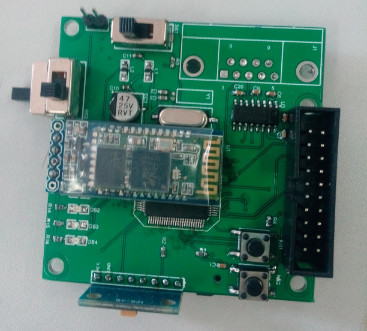

# Fall-detection-Sensor
Fall detection with ARM M3 and MPU6050
本项目为实验性质，采用keil v4开发环境开发，90%为C语言，可以通过Jtag下载到目标板
目标板芯片采用STM32 Cortex-M3 系列。采用部份网络源代码，其它代码都有接口处有注释使用方式。
同时通过I2C与MPU6050三轴加速传感器通信，采样率为每秒采样100个数据通过ADC数值转换。

<H1>采用STM32最小系统开发，硬件在keil打开文档中已经有说明，请在下载过程中注意识别！</h1>

# Image Preview

